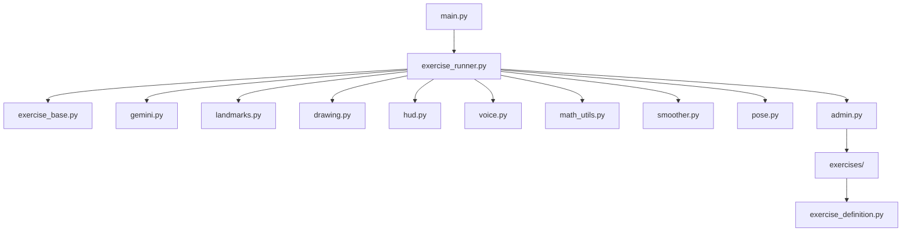

# XAI Physiotherapy

Explainable AI-guided physiotherapy exercise monitoring system.

## Badges


## Features

- Real-time pose estimation using MediaPipe
- Interactive exercise wizard for creating new routines
- Joint angle monitoring with customizable thresholds
- Audio and visual feedback during exercise performance
- Support for both dynamic and isometric exercise types
- Extensible architecture for adding new exercise definitions
- Gemini AI integration for exercise form analysis

## Installation

1. Clone the repository:
   ```
   git clone https://github.com/yourusername/xai-physiotherapy.git
   cd xai-physiotherapy
   ```

2. Install dependencies:
   ```
   pip install -r requirements.txt
   ```

3. Ensure you have a webcam connected for pose estimation.

## Usage

Run the main menu:
```
python main.py
```

Options:
- Select an exercise from the list to start a session
- Choose "Add new exercise" to launch the admin wizard

To create a new exercise directly:
```
python admin.py
```
Follow the prompts to define exercise parameters, joint checks, and feedback messages.

## Architecture



Core modules:
- **main.py**: Entry point, menu navigation
- **admin.py**: Exercise creation wizard (CLI and AI-assisted)
- **exercise_runner.py**: Main exercise loop, feedback handling
- **exercise_base.py**: Base classes for exercise definitions
- **gemini.py**: Integration with Google Gemini for form analysis
- **landmarks.py**: MediaPipe landmark constants and utilities
- **drawing.py**: OpenCV drawing utilities for pose visualization
- **hud.py**: Heads-up display overlay
- **voice.py**: Text-to-speech feedback
- **math_utils.py**: Angle calculations, smoothing
- **smoother.py**: Temporal smoothing of landmark data
- **pose.py**: Pose processing pipeline

## Exercise Creation

The admin wizard guides you through:
1. Basic info: name, description, type (dynamic/isometric)
2. Valid camera views (front, side, both)
3. Joint checks: define angles to monitor, optimal ranges, alerts
4. Rep trigger (for dynamic): enter/exit angles, depth target
5. Isometric trigger (for isometric): hold angle range, duration
6. Gemini error descriptions: natural language explanations for AI feedback

Generated exercise files are saved in the `exercises/` directory and appear automatically in the main menu.

## Requirements

See `requirements.txt` for full dependency list. Key packages:
- opencv-python, mediapipe for computer vision
- numpy, scipy for numerical operations
- google-genai for Gemini API access
- PyQt6 for potential GUI components
- pygame for audio playback
- absl-py, annotated-types for configuration